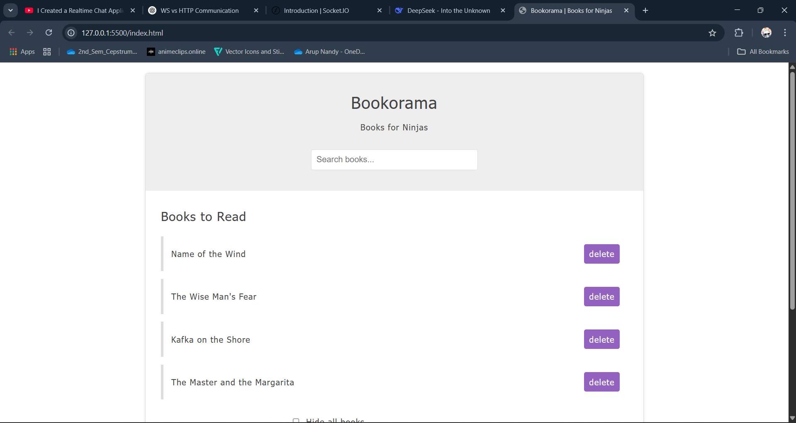

# Bookorama 📚

A clean, interactive book list manager built with HTML, CSS, and JavaScript.

## Features ✨
- Add/delete books
- Search/filter books in real-time
- Toggle book list visibility
- Tabbed interface (About/Contact)
- Fully responsive design
- Keyboard accessible

## Technologies Used 🛠️
- **Frontend**: HTML5, CSS3, JavaScript (Vanilla JS)
- **Design**: Flexbox, CSS Variables
- **Accessibility**: ARIA tags, semantic HTML
